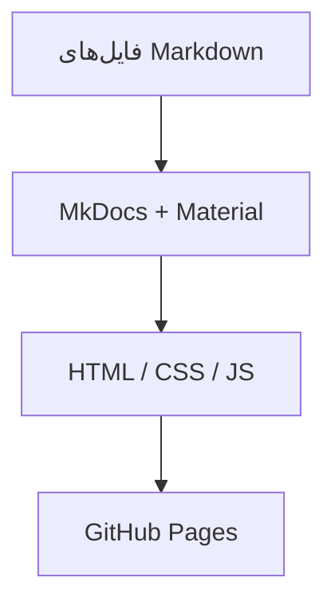

# معماری سامانه

مستندات از Markdown ساخته می‌شوند، با MkDocs به سایت استاتیک تبدیل می‌شوند و روی GitHub Pages منتشر می‌گردند.

```mermaid
flowchart TD
    A[فایل‌های Markdown] --> B[MkDocs + Material]
    B --> C[HTML / CSS / JS]
    C --> D[GitHub Pages]
```
