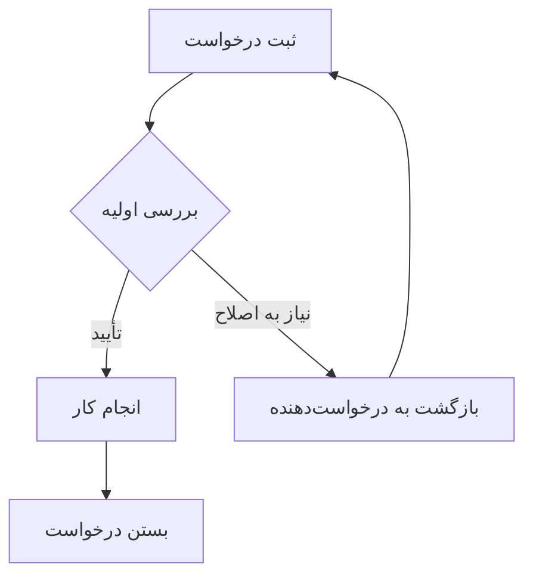
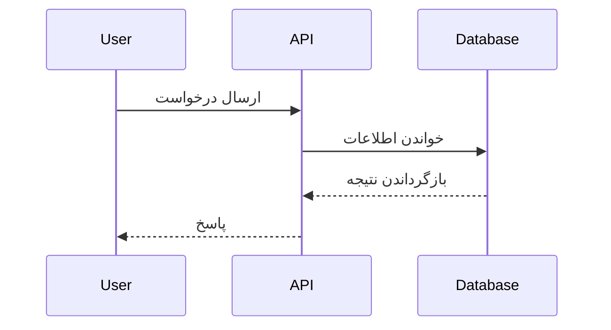

# نمای کلی

این صفحه نمونه نمودارهای Mermaid را نشان می‌دهد. Material for MkDocs بلوک‌های `mermaid` را در مرورگر به نمودار تبدیل می‌کند.

## جریان درخواست

```mermaid
flowchart TD
    A[ثبت درخواست] --> B{بررسی اولیه}
    B -->|تأیید| C[انجام کار]
    B -->|نیاز به اصلاح| D[بازگشت به درخواست‌دهنده]
    D --> A
    C --> E[بستن درخواست]
```

## توالی فراخوانی

```mermaid
sequenceDiagram
    participant U as User
    participant API as API
    participant DB as Database

    U->>API: ارسال درخواست
    API->>DB: خواندن اطلاعات
    DB-->>API: بازگرداندن نتیجه
    API-->>U: پاسخ
```
