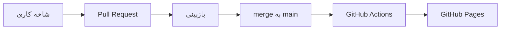

# گردش‌کار Git

شاخه اصلی این ریپو `main` است. تغییر مستندات را با pull request بررسی کنید و بعد از merge، انتشار Pages به‌صورت خودکار انجام می‌شود.

```mermaid
flowchart LR
    A[شاخه کاری] --> B[Pull Request]
    B --> C[بازبینی]
    C --> D[merge به main]
    D --> E[GitHub Actions]
    E --> F[GitHub Pages]
```
