# راهنمای برگزاری جلسات نمو
## مدیران ارشد ← مدیران میانی

---

## بخش اول: مقدمه

**اصل اساسی:**
مدیران ارشد باید برای توسعهٔ مدیران میانی خود و کمک به تبدیل شدن آن‌ها به مدیرانی بهتر، وقت و انرژی اختصاص دهند.

یکی از مهم‌ترین بسترهای این توسعه، **جلسات نمو** است؛ یعنی جلسات یک‌به‌یک توسعه‌ای که در بازه‌های زمانی هر یک تا سه ماه با هدف رشد مدیریتی برگزار می‌شوند.

مدیران میانی معمولاً کسی را ندارند که واقعاً دربارهٔ مدیریتشان با آن‌ها گفت‌وگو کند. آن‌ها گزارش می‌دهند، خروجی ارائه می‌کنند و پاسخ‌گو هستند؛ اما کمتر پیش می‌آید کسی کنارشان بنشیند و بپرسد:
* در تصمیم‌گیری‌هایت چه الگویی داری؟
* کجاها بیش از حد درگیر جزئیات می‌شوی؟
* چرا بعضی گفت‌وگوهای سخت را عقب می‌اندازی؟
* تیم تو چقدر مستقل شده است؟

مدیر ارشد می‌تواند این نقش را ایفا کند و در بسیاری از موارد، بهترین گزینه برای انجام آن است.

### سه دلیل مهم برای اهمیت این جلسات:

1. **مدیران میانی در نقطهٔ فشار سازمان قرار دارند:**
   آن‌ها از یک‌سو باید تیم خود را مدیریت کنند و از سوی دیگر پاسخ‌گوی مدیران بالادست باشند. اگر کسی به رشد مهارت‌های مدیریتی آن‌ها توجه نکند، معمولاً درگیر مسائل عملیاتی روزمره می‌شوند و فرصت رشد پیدا نمی‌کنند. در صورت عدم رشد، پیامدهای زیر رخ می‌دهد:
   * عملیات‌زده شدن
   * فرسودگی شغلی
   * روی آوردن به میکرومدیریت
   * عدم رشد تیم‌ها

2. **مدیر ارشد بهترین دید را نسبت به الگوهای مدیریتی دارد:**
   او می‌تواند الگوها و ضعف‌های تکرارشونده را بهتر ببیند؛ مثلاً اینکه کدام مدیر در تصمیم‌گیری کند است، کدام‌یک در تفویض اختیار مشکل دارد، یا کدام مدیر در مدیریت تعارض ضعیف عمل می‌کند.

3. **ساختن نسل بعدی رهبران:**
   یکی از وظایف مهم مدیران ارشد در سازمان‌های سالم، پرورش مدیران بعدی و تقویت خط رهبری سازمان است. اگر مدیران میانی رشد نکنند، «پایپلاین رهبری» خشک می‌شود.

---

## بخش دوم: موانع برگزاری جلسات نمو

با اینکه این جلسات منطقی و مفید به‌نظر می‌رسند، چند مانع اصلی از برگزاری آن‌ها جلوگیری می‌کند:

### الف) دیدگاه «نتیجه‌محور» در مقابل «پرورش‌محور»
بعضی مدیران ارشد ناخودآگاه فکر می‌کنند وظیفه‌شان فقط این است که:
* هدف بدهند
* خروجی بگیرند
* مشکل را حل کنند
* گزارش بخواهند

در این نگاه، توسعهٔ مدیران میانی یک کار فرعی یا لوکس محسوب می‌شود و در نتیجه، جلسهٔ یک‌به‌یک تبدیل به جلسهٔ پیگیری KPI می‌شود، نه توسعهٔ توان مدیریتی.

### ب) بلعیده شدن توسط فشار کار روزمره
گاهی ریتم کار آن‌قدر عملیاتی، آتش‌نشانی‌محور و شلوغ است که مدیر ارشد زمانی برای توسعهٔ مدیران خود ندارد. جلسه‌ای که قرار بود دربارهٔ **تفویض اختیار، ساخت تیم قوی‌تر یا مدیریت تعارض** باشد، تبدیل می‌شود به:
* پروژه X کجا رسید؟
* مشتری Y چه شد؟
* بودجه Z چرا عقب است؟

**نکته:** فشار کوتاه‌مدت، رشد بلندمدت را می‌خورد. اما سرمایه‌گذاری روی رشد مدیران می‌تواند به مرور فشار کوتاه‌مدت را هم کاهش دهد.

### ج) فقدان روحیه و مهارت کوچینگ
بسیاری از مدیران ارشد در اجرا، استراتژی یا تصمیم‌گیری قوی‌اند، اما در توسعه دادن دیگران لزوماً مهارت ندارند. در این حالت جلسه توسعه‌ای عملاً تبدیل می‌شود به:
> «بگذار من بگویم چه کار کن»
به‌جای:
> «بیا با هم توان مدیریتی تو را رشد بدهیم»

### د) ترس از قضاوت و نبود امنیت روانی
مدیر میانی ممکن است از بیان ضعف‌هایش بترسد:
* «اگر بگویم در مدیریت تیمم ضعف دارم، نکند من را ناتوان ببینند؟»
* «اگر دربارهٔ تردیدهایم حرف بزنم، نکند در ارزیابی اثر منفی بگذارد؟»

در نتیجه، فرد نسخه‌ای کنترل‌شده و تمیز از وضعیت را ارائه می‌دهد و جلسه عمیق نمی‌شود. در اینجا مدیر ارشد باید روی ایجاد **امنیت روانی** تمرکز کند.

### ه) تداخل «ارزیابی عملکرد» و «توسعه»
اگر مرز بین این دو روشن نباشد، مدیر میانی محافظه‌کار می‌شود. جلسه توسعه‌ای فقط وقتی اثر دارد که فرد بداند اینجا جایی برای **فکر کردن، آزمودن، بازخورد گرفتن و یاد گرفتن** است، نه جایی برای تصمیم‌گیری دربارهٔ ارتقا یا بازخواست.

### و) مقاومت یا پذیرش نکردن نیاز به رشد
برخی مدیران میانی ممکن است این جلسات را به عنوان «تلاش برای اصلاح» یا «نشانه عدم رضایت مدیر ارشد» ببینند و گارد بگیرند.
* **نشانه‌ها:** پاسخ‌های کوتاه، تدافعی بودن در برابر بازخوردها، یا تلاش برای تغییر بحث به مسائل عملیاتی.
* **راهکار:** تأکید بر اینکه این جلسات برای «بهترین‌ها»ست تا «استثنایی» شوند، نه برای «ضعیف‌ها» تا «معمولی» شوند. روی مفهوم «سرمایه‌گذاری روی ظرفیت» به‌جای «پر کردن خلأ» تمرکز کنید.

---

## بخش سوم: مدل‌های پیشنهادی برای برگزاری جلسات نمو

### مدل اول: توسعهٔ مبتنی بر شایستگی (Competency-based Development)
در این مدل، توسعه بر اساس شایستگی‌های مدیریتی مشخص انجام می‌شود. نمونه‌هایی از این شایستگی‌ها:
* تفویض اختیار
* مربیگری و مدیریت عملکرد
* شنیدن موثر و بازخورد
* انتخاب عضو جدید تیم
* هوش هیجانی و توسعهٔ افراد
* هدف‌گذاری، اولویت‌بندی و برنامه‌ریزی
* مدیریت تعارض و ایجاد امنیت روانی

**روش اجرا:**
1. از **چرخ عملکرد** استفاده کنید.
2. روی یک **نمودار راداری** با همدیگر ۵ شایستگی را انتخاب کرده و به آن‌ها امتیاز دهید.
3. مدیر دو شایستگی را برای تقویت انتخاب کند و اقدامات لازم را تعریف کند.
4. مدیر باید به این سوالات پاسخ دهد:
   * نشانه‌های قوت فرد در این حوزه چیست؟
   * نشانه‌های ضعف چیست؟
   * یک موقعیت واقعی که این مهارت در آن مهم بوده کدام بوده؟
   * برای بهبود، چه تمرین عملی تعریف می‌شود؟
5. در جلسه بعد، پیشرفت را بر اساس معیارهای واقعی بررسی کنید.

**مزایا:** توسعه تصادفی نیست و روند رشد قابل پیگیری است.

#### نمونه سوالات برای شفاف‌سازی شایستگی‌ها:
* **خودآگاهی مدیریتی:** این ماه کجا بیشترین رشد را در خودت دیدی؟ کدام تصمیم مدیریتی را اگر برگردی عقب، متفاوت می‌گیری؟
* **تفویض اختیار:** الان چه کارهایی هنوز بیش از حد در دست خودت مانده؟ بزرگ‌ترین ترس تو از تفویض چیست؟
* **مدیریت عملکرد:** کدام عضو تیم بیشترین انرژی تو را می‌گیرد؟ آیا مسئله مهارت است، انگیزه است یا تناسب نقش؟
* **تیم‌سازی:** آیا تیمت بدون حضور مستقیم تو هم درست کار می‌کند؟ اگر یک ماه نباشی، کجاها سیستم می‌ریزد؟

---

### مدل دوم: تأمل موقعیتی (Situational Reflection)
در این مدل، جلسه حول یک اتفاق واقعی (Case Study) می‌چرخد. مثال‌ها:
* قطع همکاری یا تذکر به یکی از اعضای تیم
* تعارض بین دو عضو کلیدی یا ناهماهنگی بین واحدها
* مقاومت تیم در برابر تغییر یا شکست یک پروژه

**سوالات کلیدی برای تحلیل:**
* دقیقاً چه شد؟ تو آن موقع چه برداشتی داشتی؟
* چه فرضی دربارهٔ آدم‌ها یا موقعیت داشتی؟
* چه کاری جواب داد و چه کاری جواب نداد؟
* الان چه گزینه‌هایی داری و ریسک هر کدام چیست؟
* تو به کدام راه‌حل متمایلی و چرا؟ گام بعدی چیست؟
* اگر دوباره تکرار شود، چه کار متفاوتی می‌کنی؟

**مزایا:** یادگیری از تجربه واقعی، خروج از حالت تئوری، کاهش وابستگی به مدیر ارشد و رشد قدرت قضاوت.

**هشدار:** مدیر ارشد نباید زود وارد «راه‌حل‌دادن» شود؛ هدف کمک به فکر کردن بهتر و افزایش بلوغ مدیریتی است.

---

### مدل سوم: دوایر عملکردی (Performance Circles)
این مدل (برگرفته از کتاب *Leadership Pipeline*) برای فهم وضعیت عملکرد مدیر در نقش فعلی‌اش به کار می‌رود. عملکرد را به‌صورت یک دایره می‌بیند که هرچه کامل‌تر باشد، فرد به انتظارات نقش نزدیک‌تر است.

**انواع وضعیت‌های عملکردی:**
1. **عملکرد کامل (Full Performance):** فرد تمام مسئولیت‌ها و انتظارات نقش فعلی را به‌درستی انجام می‌دهد و در سطح خود جا افتاده است.
2. **عملکرد استثنایی (Exceptional Performance):** فرد فراتر از انتظارات عمل می‌کند. (اگر مدیریت نشود، ممکن است نشانهٔ بی‌قراری یا آمادگی برای نقش بالاتر باشد).
3. **عملکرد نامناسب (Inappropriate Performance):** فرد بخشی از انتظارات نقش را انجام نمی‌دهد و انرژی‌اش را صرف کارهای خارج از سطح یا نقش خود می‌کند.

**سه محور هم‌راستایی برای رسیدن به Full Performance:**
* **مهارت‌ها:** آیا مهارت‌های لازم برای این سطح را دارد؟
* **تخصیص زمان:** آیا وقت خود را صرف کارهای درست در این سطح می‌کند؟
* **ارزش‌ها و ذهنیت:** آیا تعریف او از موفقیت با سطح فعلی نقش هماهنگ است؟

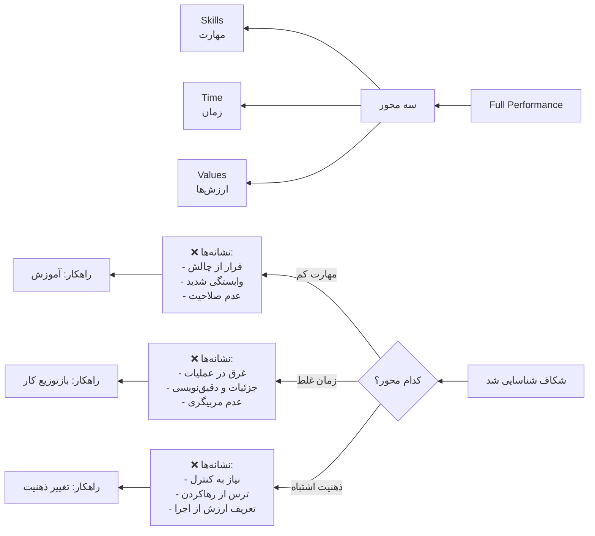

#### راهنمای سریع گفت‌وگو در جلسه نمو (مدل دوایر):

**۱. تصویر کلی نقش:**
* در حال حاضر فکر می‌کنی چقدر در این نقش جا افتاده‌ای؟
* کجاها هنوز حس می‌کنی مثل کارشناس کار می‌کنی؟

**۲. بررسی مهارت‌ها (Skills):**
* در تفویض اختیار، تصمیم‌گیری، بازخورد یا مدیریت تعارض کجا چالش داری؟
* *نشانه‌های شکاف:* فرار از گفت‌وگوهای سخت، ورود به اجرا به‌جای مدیریت، وابستگی شدید تیم به مدیر.

**۳. بررسی مصرف زمان (Time Application):**
* چه کارهایی را خودت انجام می‌دهی که باید واگذار شوند؟
* آیا برای مربی‌گری و ساختن تیم وقت کافی می‌گذاری؟
* *نشانه‌های شکاف:* غرق شدن در عملیات، درگیری با جزئیات، حل مستقیم مسائل به‌جای توانمندسازی.

**۴. بررسی ارزش‌ها و ذهنیت (Work Values):**
* به نظر تو موفقیت در این نقش یعنی چه؟
* چقدر راحتی که دیگران جلو بیفتند و تو نقش مربی داشته باشی؟
* *نشانه‌های شکاف:* نیاز زیاد به کنترل، سختی در رها کردن کارها، تعریف ارزش شخصی از طریق انجام مستقیم کار.

**سوال پایانی:**
> «اگر بخواهیم صادق باشیم، کدام بخش از دایره عملکرد تو هنوز کامل نشده است؟»
(سپس بررسی کنید که آیا شکاف در **مهارت**، **زمان** یا **ذهنیت** است تا راهکار متناسب ارائه شود).

### مقایسهٔ سه مدل

حالا که هر سه مدل معرفی شدند، جدول زیر آن‌ها را برای انتخاب مدل مناسب در هر موقعیت مقایسه می‌کند:

| معیار | شایستگی | موقعیتی | دوایر عملکردی |
|-------|---------|---------|---------------|
| **هدف اصلی** | توسعهٔ مهارت‌های خاص | یادگیری از تجربه واقعی | درک سطح ایفای نقش |
| **شرایط استفاده** | توسعهٔ برنامه‌ریزی‌شده | زمان حل مسئلهٔ حقیقی | سنجش و هدف‌گذاری دوره‌ای |
| **مدت جلسه** | ۴۵-۶۰ دقیقه | ۳۰-۴۵ دقیقه | ۶۰ دقیقه |
| **تکرار** | ماهانه یا ۶ هفته‌ای | برحسب نیاز | هر سه ماه یک‌بار |
| **آمادگی مورد نیاز** | انتخاب شایستگی قبل از جلسه | بدون آمادگی خاص | نمودار راداری ترسیم‌شده |
| **نتیجهٔ انتظاری** | طرح عمل برای مهارت | درک بهتر و تصمیم بعدی | نقشهٔ توسعهٔ ۳ ماهه |
| **سطح بلوغ** | برای مدیران میانی در حال توسعه | برای تمام سطح‌ها | برای مدیران در دورهٔ انتقال |

**نتیجه‌گیری:** هر سه مدل مکمل یکدیگرند. در یک برنامهٔ شش‌ماهه می‌توانید ترکیبی از آن‌ها را به‌کار ببرید:
- ماه اول و دوم: **دوایر عملکردی** (تشخیص)
- ماه دوم تا پنجم: **شایستگی** (توسعه)
- در بین راه: **موقعیتی** (وقتی موضوع واقعی پیش آید)

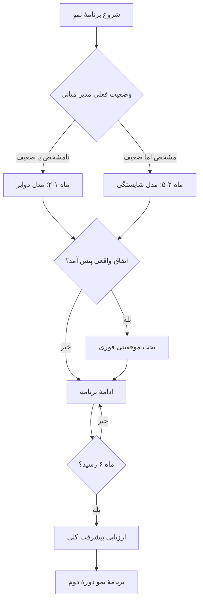

---

## بخش چهارم: نمونه‌های عملی جلسات نمو

### نمونه ۱ - مدل شایستگی: توسعهٔ تفویض اختیار

**پیش‌زمینه:**
محمد یک مدیر میانی با ۵ سال تجربه است. او جزئیات و ساختار پروژه‌ها را خوب مدیریت می‌کند، اما هنوز اکثر تصمیم‌های مهم را به دست خود می‌گیرد و تیمش بدون حضور او بی‌تصمیم می‌ماند.

**سوال افتتاحیه مدیر ارشد:**
«محمد، ماه گذشته چه کاری انجام دادی که اگر برگردی عقب، متفاوت انجام می‌دادی؟»

**جریان جلسه:**
- محمد: «به یک پروژه دیر رسیدیم. باید زودتر تصمیم می‌گرفتم.»
- مدیر ارشد: «فاصلهٔ بین تصمیم درست و تصمیم سریع چیه؟ یعنی اگر علی یا سارا تصمیم می‌گرفتند چطور بود؟»
- محمد: «احتمالاً نتیجه فرقی نمی‌کرد، فقط لازم نبود منتظر تأیید من بمانند.»
- مدیر ارشد: «پس الآن چه بخش‌هایی می‌تونی واگذار کنی تا تیم سریع‌تر بشه؟»

**نتیجه و اقدام:**
- محمد دو سطح تصمیم‌گیری را برای تیمش تعریف کرد: (الف) تصمیمات کوچک بدون تأیید، (ب) تصمیمات بزرگ با اطلاع سریع
- هدف: در ماه بعد، ۳ تصمیم منتقل کند
- معیار موفقیت: حداقل یک مورد پیش بیاید که تیم به‌طور مستقل تصمیم بگیرد

**جلسهٔ بعدی:**
مدیر ارشد نتیجه را بررسی کرد؛ محمد موفق بود و دید که تیمش سریع‌تر حرکت می‌کند. سپس به شایستگی بعدی رفتند.

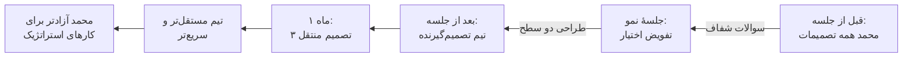

---

### نمونه ۲ - مدل موقعیتی: تحلیل یک تعارض تیمی

**موقعیت واقعی:**
رضا باید بین دو نفر از تیمش که بر سر اولویت پروژه با یکدیگر ناهماهنگ بودند، میانجی شود. او زود قضاوت کرد و نظر خودش را تحمیل کرد؛ حالا فضای تیم خراب است.

**سوالات تحلیلی مدیر ارشد:**
1. «دقیقاً چه شد؟ هرکدوم چه گفتند؟»
2. «تو آن لحظه چه شنیدی؟ چه فکر کردی؟»
3. «اگر فاصله می‌گرفتی و به آن‌ها گوش می‌دادی چی می‌شد؟»
4. «الآن کدام راه داری؟ ریسک هر کدام چیه؟»
5. «اگر دوباره تکرار بشه، کجا تفاوت می‌کنی؟»

**درس‌های یادگیری:**
- مدل: **اول گوش کن، بعد قضاوت کن**
- رضا تشخیص داد که تحت فشار وقت، به‌جای فهمیدن موضوع، عجولانه تصمیم گرفته بود
- نقشهٔ عملی: جلسهٔ بعدی با هردو، سپس تصمیم مشترک

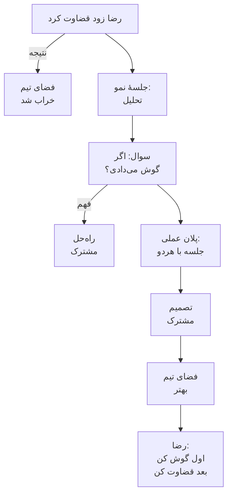

---

### نمونه ۳ - مدل دوایر: تشخیص دلیل عملکرد نامناسب

**موقعیت:**
الهام مدیر پروژه است. انرژی‌اش صرف آپدیت‌های روزمره و جزئیات می‌شود. پروژه پیش می‌رود، اما او خسته است و بازخوردی دربارهٔ روش کار خود دریافت نکرده است.

**گفت‌وگو:**
- مدیر ارشد: «احساس می‌کنی برای کیوان و ابراهیم (اعضای تیمت) نقش‌های واضحی تعریف کرده‌ای؟»
- الهام: «نه، خودم هنوز در جزئیات گیر افتاده‌ام.»
- مدیر ارشد: «پس شکاف کجاست؟ مهارت واگذاری نقش را نداری؟»
- الهام: «نه، می‌دونم چطور. فقط اطمینان ندارم کار صحیح انجام بشه.»
- مدیر ارشد: «تعریف «صحیح» برای تو چیه؟ کیست که می‌فهمه بهتر؟»
- الهام: «من فقط نمی‌خوام اشتباه بشه و به من برگردانند.»

**نتیجه‌گیری:**
- شکاف در **ذهنیت** (نیاز زیاد به کنترل و ترس از شکست)، نه مهارت
- اقدام: الهام لیستی از خطاهای قابل تحمل تعریف کرد
- هدف: یادگیری جمعی و کاهش تکرار خطاهای مشابه

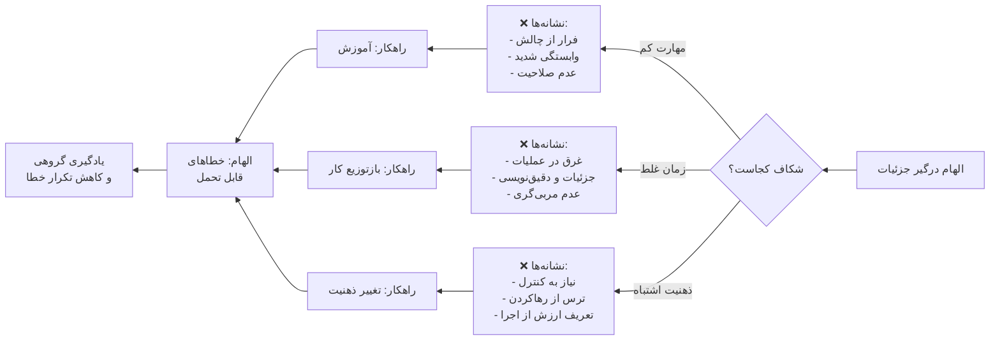

---

## جدول دسترسی سریع (Cheat Sheet) برای مدیر ارشد

اگر در حین جلسه نیاز دارید سریعاً مدل مناسب یا سوال کلیدی را پیدا کنید:

| مدل | هدف | سوال کلیدی | خروجی مورد انتظار |
| :---: | :---: | :---: | :---: |
| **شایستگی** | توسعه مهارت خاص | «کدام رفتار در این مهارت نیاز به تغییر دارد؟» | طرح عمل (Action Plan) |
| **موقعیتی** | یادگیری از تجربه | «اگر دوباره تکرار شود، چه کار متفاوتی می‌کنی؟» | درک الگو و تغییر تصمیم |
| **دوایر** | تشخیص سطح ایفای نقش | «شکاف کجاست: مهارت، زمان یا ذهنیت؟» | نقشه توسعه ۳ ماهه |

---

## بخش پنجم: دستورالعمل فرآیند جلسهٔ نمو (۶۰ دقیقه)

### ساختار پیشنهادی:

| مرحله | مدت | نقش مدیر ارشد | خروجی |
|-------|------|----------------|--------|
| **۱. سوال افتتاحیه** | ۵ دقیقه | پرسش باز و شنیدن | ایجاد فضای باز |
| **۲. کاوش و فهم** | ۲۰ دقیقه | پرسش تکراری و کاوش | درک وضعیت واقعی |
| **۳. تحلیل الگو** | ۱۵ دقیقه | تأمل مشترک | شناخت دلایل ریشه‌ای |
| **۴. طراحی اقدام** | ۱۵ دقیقه | همکاری در فکر | پلان عملی واضح |
| **۵. بسته‌بندی و تعهد** | ۵ دقیقه | خلاصه و تأیید | وضوح مسئولیت‌ها |

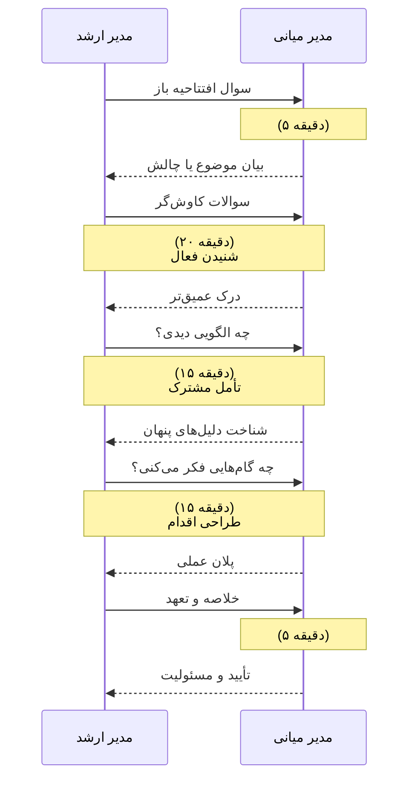

### سوالات کلیدی برای هر مرحله:

#### مرحلهٔ ۱: افتتاحیه (تن‌سازی)
- «چه اتفاقی برای تو مهم است که از آن بحث کنیم؟»
- «ماه گذشته چه اتفاقی افتاد که درسی از آن گرفتی؟»
- «چه چیز تو را در حال حاضر درگیر کرده است؟»

#### مرحلهٔ ۲: کاوش (سمعک)
**مهارت: گوش‌دادن فعال**
- دنبال کنید: «بگو بیشتر.»
- تکرار کنید: «اگر درست فهمیدم، تو...»
- کنجکاوی: «چه چیز تو را انتخاب کرد؟»
- درون‌نگری: «احساس تو دربارهٔ این چیه؟»

#### مرحلهٔ ۳: تحلیل (الگو‌یابی)
- «این الگو تا بحال پیش‌آمده؟»
- «چه فرضی دربارهٔ مردم یا موقعیت داشتی؟»
- «نقطهٔ تصمیم‌گیری کجا بود؟»
- «می‌شد متفاوت انجام بشه؟»

#### مرحلهٔ ۴: اقدام (طراحی)
- «اگر بخواهی این را تغییر دهی، چه گام‌های کوتاه‌مدت فکر می‌کنی؟»
- «کدام گام ریسک دارد و چرا؟»
- «چه معیاری نشان می‌دهد تو پیشرفت کردی؟»
- «تا جلسهٔ بعد (۶ هفتهٔ بعد) چه مهم است انجام دهی؟»

#### مرحلهٔ ۵: بسته‌بندی
- «خلاصه اینکه...» (مدیر ارشد خلاصه می‌کند)
- «به نظرت چه شد؟» (تأیید از مدیر میانی)
- «تا جلسهٔ بعد من چه انتظار دارم و تو؟»

---

## بخش ششم: خطرات و اشتباهات رایج

### ❌ اشتباه ۱: زود وارد «حل مسئله» شدن

**خطر:** مدیر ارشد به‌جای پرسیدن سوال، خودش وارد می‌شود و جواب می‌دهد.

**علامت:** مدیر ارشد بیش از ۳۰٪ حرف می‌زند.

**راهکار:**
- قانون: مدیر میانی باید ۷۰٪ صحبت کند
- اگر خود را وسوسه کردی، بپرس: «تو چه نظری داری؟»

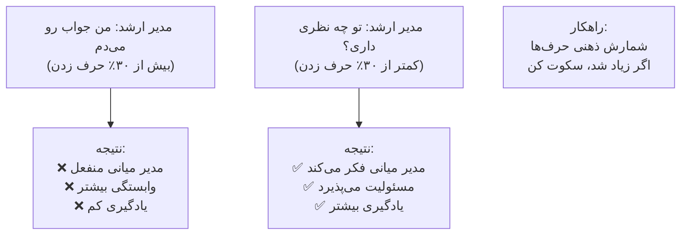

---

### ❌ اشتباه ۲: تحمیل تجربهٔ شخصی به‌جای پرسش

**خطر:** مدیر ارشد به‌جای کمک به یادگیری مدیر میانی، تجربهٔ شخصی خودش را جایگزین فکر او می‌کند.

**علامت:**
- «من جای تو بودم...»
- «من این کار رو این‌طور می‌کردم...»

**راهکار:**
- سوال: «اگر با تمام اطلاعاتی که داری فکر کنی، چه گزینه‌ای منطقی‌تر است؟»

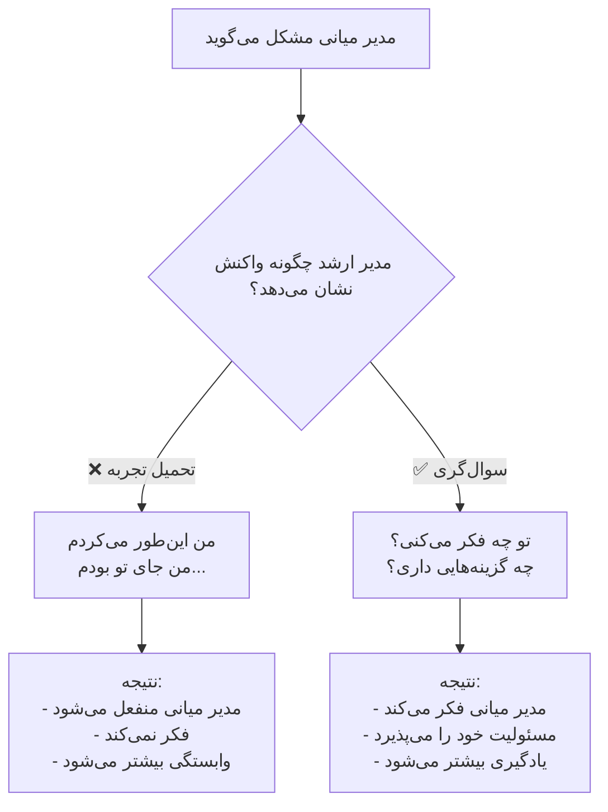

---

### ❌ اشتباه ۳: ترکیب کردن ارزیابی با توسعه

**خطر:** مدیر میانی فکر می‌کند این جلسه برای ارزیابی عملکردش است، نه توسعه.

**علامت:** مدیر میانی محافظه‌کار می‌شود و نسخه‌ای کنترل‌شده و «تمیز» از خودش ارائه می‌دهد.

**راهکار:**
- جلسه را باز کن: «این جایی برای یادگیری و آزمودن است، نه قضاوت.»
- مسئولیت: این جلسه از **ارزیابی جدا** است.

---

### ❌ اشتباه ۴: درگیر شدن در جزئیات عملیاتی

**خطر:** جلسهٔ نمو تبدیل می‌شود به جلسهٔ KPI.

**علامت:**
- «پروژه X چرا عقب است؟»
- «مشتری Y با تو چی شکایت داشت؟»

**راهکار:**
- جملهٔ فاصله‌گذار: «این برای میز کار است، نه برای رشد مدیریتی.»
- تمرکز: «بیش از خروجی، روش و تصمیم‌گیری تو را می‌خواهم نگاه کنم.»

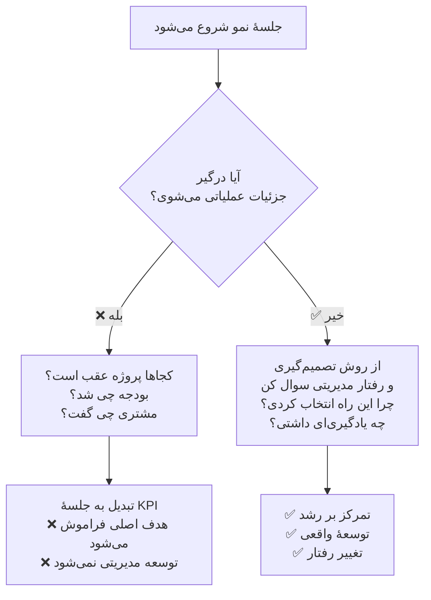

---

### ❌ اشتباه ۵: عدم ایجاد امنیت روانی

**خطر:** مدیر میانی ضعف‌هایش را پنهان می‌کند.

**علامت:** مدیر میانی فقط درباره موضوعات «ایمن» صحبت می‌کند.

**راهکار:**
- معیاری برای امنیت: «اینجا تنها جایی است که می‌تونی غلط بگی و بیاموزی.»
- عمل: هرگز از شکست‌های کوچک برای ارزیابی منفی استفاده نکن.

---

## بخش هفتم: شاخص‌های موفقیت و پیگیری پیشرفت

### شاخص‌های فوری (جلسهٔ بعدی):
- ✅ آیا اقدامات تعریف‌شده انجام شد؟
- ✅ آیا مدیر میانی بدون تأکید عمل کرد؟
- ✅ آیا نتایج مشاهده‌پذیر هستند؟

### شاخص‌های میان‌مدت (۳ ماه):
- ✅ کاهش وابستگی تیم به مدیر
- ✅ افزایش تعداد مستقل تصمیم‌گیری‌های تیم
- ✅ بهبود در رفتارهای مدیریتی (مثلاً بازخورد بیشتر، تفویض بهتر)
- ✅ کاهش حضور مدیر در جزئیات روزمره

### شاخص‌های بلندمدت (۶ تا ۱۲ ماه):
- ✅ پیدایش مدیران نوپا در تیم
- ✅ کاهش چرخش کارکنان
- ✅ ارتقای مدیر میانی به سطح بالاتر
- ✅ شیوهٔ ایجاد روایت کوچینگ در سازمان

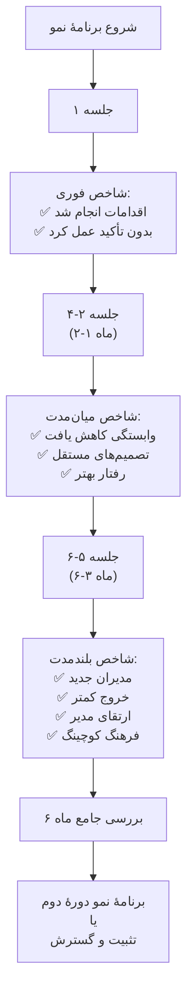

### جدول پیگیری ۶ ماهه:

| ماه | شاخص اول | شاخص دوم | یادداشت‌ها |
|-----|----------|----------|---------|
| ماه ۱-۲ | تعداد اقدام | پذیرش | |
| ماه ۳ | کاهش وابستگی | عملکرد | |
| ماه ۴-۶ | نتایج واقعی | رفتارهای جدید | |

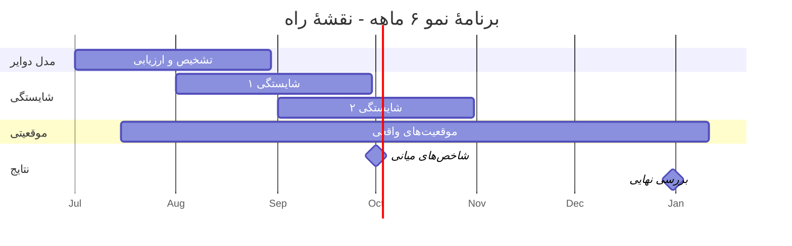

---

## بخش هشتم: منابع و کتاب‌های پیشنهادی

### برای مدیر ارشد (کوچ):

1. **«The Coaching Habit»** (Michael Bungay Stanier)
   - موضوع: ۷ سوال قدرتمند برای بهتر شنیدن
   - فایده: تبدیل جلسات به تمرین‌های یادگیری

2. **«Radical Candor»** (Kim Scott)
   - موضوع: چگونه از دیگران بیشتر درخواست کنیم و آن‌ها را توسعه دهیم
   - فایده: تعادل بین مراقبت و تحدی

3. **«The Culture Code»** (Daniel Coyle)
   - موضوع: نقش کوچینگ در ساختن تیم‌های قوی
   - فایده: پیوند بین توسعهٔ فردی و سلامت تیم

4. **«Emotional Intelligence»** (Daniel Goleman)
   - موضوع: خود‌آگاهی و مدیریت روابط
   - فایده: درک درون‌مایهٔ مشکلات مدیریتی

### برای مدیر میانی (رشد):

1. **«First 90 Days»** (Michael Watkins)
   - موضوع: انتقال موفق به نقش‌های جدید
   - فایده: نقشهٔ عملی برای سازگاری

2. **«Crucial Conversations»** (Kerry Patterson)
   - موضوع: مهارت‌های گفت‌وگوهای سخت
   - فایده: حل تعارض‌های تیمی

3. **«Dare to Lead»** (Brené Brown)
   - موضوع: رهبری از شجاعت و آسیب‌پذیری
   - فایده: رهبری احساسی و صادقانه

### برای سازمان (مدیریت دانش):

1. **«Leadership Pipeline»** (Charan, Drotter, Noel)
   - موضوع: انتقال و توسعهٔ نسل‌های رهبری
   - فایده: نقشهٔ برای ساختن خط رهبری

2. **«Winning»** (Jack Welch)
   - موضوع: ارزیابی و توسعهٔ مدیران
   - فایده: تطابق بین استراتژی و افراد

---

## بخش نهم: چک‌لیست قبل از اولین جلسه

- [ ] **زمان و مکان:** جلسه را در جایی خصوصی و بدون مزاحمت برگزار کن (۶۰ دقیقه)
- [ ] **هدف را روشن کن:** «این جلسه برای رشد توان مدیریتی توست، نه ارزیابی.»
- [ ] **مرز بین جلسات:** به‌وضوح بگو این جلسه **جدا از** جلسات KPI یا ارزیابی است.
- [ ] **امنیت روانی:** «اینجا جایی برای صادق بودن و غلط کردن است.»
- [ ] **سوال افتتاحیه:** از سوالات باز استفاده کن، نه بسته.
- [ ] **یادداشت:** دفتری برای خاطرات و اقدامات نگه دار.
- [ ] **دنبال کاری:** قبل از جلسهٔ بعد، پیشرفت را با هم بررسی کن.

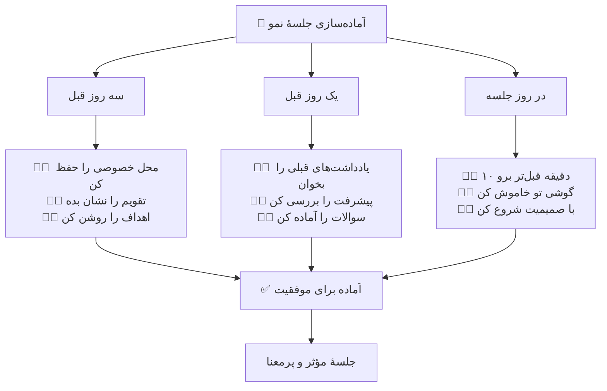

---

## نکات نهایی

۱. **این روش تک شب تغییر ایجاد نمی‌کند.** توسعهٔ مدیریتی یک سرمایه‌گذاری بلندمدت است. صبر کن و الگوها را دنبال کن.

۲. **مدیر ارشد نیز در حال رشد است.** اولین جلسات ناشی و نامتعادل خواهد بود. تمرین و فیدبک نقش‌آفرین است.

۳. **فیدبک و تطبیق ضروری‌اند.** هر ۳ ماه، مدیر ارشد و مدیر میانی با هم بنشینند: «چه تغییری در رابطه و رشد دیدی؟»

۴. **سازمان باید این را تقدیر کند.** اگر مدیران ارشد را برای «نتیجه سریع» تنها ستایش کنی، توسعه هیچ‌وقت شکل نمی‌گیرد.

۵. **مدیریت در مقیاس بالا (Scaling):**
اگر تعداد مدیران میانی شما زیاد است و برگزاری جلسات ۶۰ دقیقه‌ای ماهانه دشوار است:
- **چرخش مدل‌ها:** هر ماه برای هر مدیر فقط یک مدل را اجرا کنید (مثلاً ماه اول دوایر، ماه دوم شایستگی).
- **توسعه گروهی:** برخی شایستگی‌های مشترک را در جلسات گروهی (Peer Learning) بررسی کنید و جلسات یک‌به‌یک را به تحلیل شخصی محدود کنید.
- **پایش غیرهمزمان:** از مدیران بخواهید قبل از جلسه، تأملات خود را به صورت مکتوب بفرستند تا زمان جلسه صرف تحلیل و طراحی اقدام شود، نه توصیف اتفاقات.

---

## خلاصهٔ نهایی: چرخهٔ توسعهٔ مدیران میانی

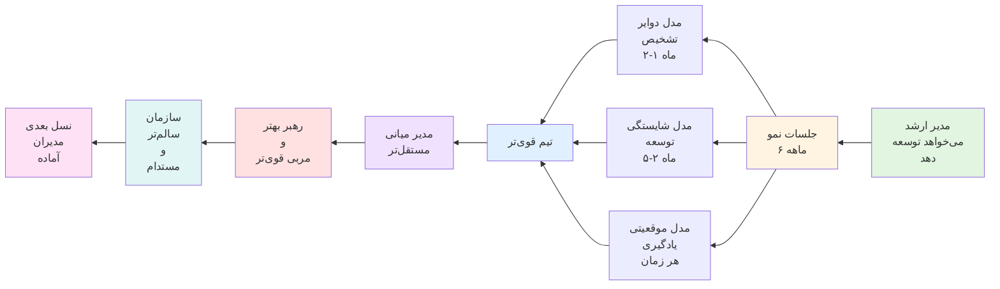
